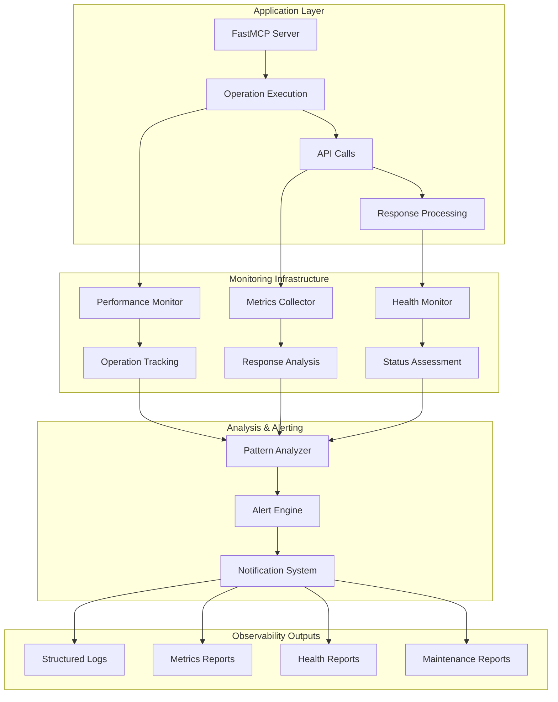

# Make.com FastMCP Server - Monitoring & Observability Guide

**Version**: 2.0.0 - Enhanced Monitoring Edition  
**Last Updated**: 2025-08-25  
**Status**: Production Ready ✅

## 📋 Table of Contents

- [Overview](#overview)
- [Monitoring System Architecture](#monitoring-system-architecture)
- [Performance Monitoring](#performance-monitoring)
- [Health Monitoring](#health-monitoring)
- [Metrics Collection](#metrics-collection)
- [Log Pattern Analysis](#log-pattern-analysis)
- [Dependency Monitoring](#dependency-monitoring)
- [Alert Management](#alert-management)
- [Dashboard Integration](#dashboard-integration)
- [Troubleshooting Guide](#troubleshooting-guide)

## Overview

The Make.com FastMCP Server includes a comprehensive monitoring and observability system designed for production environments. The monitoring system provides real-time insights into performance, health, security, and operational status without impacting server performance.

### Key Monitoring Features

**🎯 Performance Tracking**:

- Request timing with percentile analysis
- Memory usage monitoring
- CPU utilization tracking
- Concurrent operation monitoring

**🏥 Health Monitoring**:

- API connectivity checks
- System resource validation
- Dependency health assessment
- Automated status reporting

**📊 Metrics Collection**:

- Operation success/failure rates
- Response time histograms
- Error categorization and trending
- Usage pattern analysis

**🔍 Log Pattern Analysis**:

- 25 predefined alerting patterns
- Real-time security threat detection
- Performance degradation alerts
- Automated escalation management

**🔒 Security Monitoring**:

- Authentication failure detection
- Suspicious request pattern identification
- Rate limiting violation alerts
- API abuse prevention

## Monitoring System Architecture

### High-Level Architecture



### Component Integration

**Event-Driven Architecture**:

- **Non-blocking monitoring**: Zero performance impact on main operations
- **Asynchronous processing**: Background metrics collection and analysis
- **Correlation tracking**: End-to-end request tracing
- **Real-time alerting**: Immediate notification of critical issues

## Performance Monitoring

### PerformanceMonitor Class

**Location**: `src/simple-fastmcp-server.ts:96-182`

**Core Functionality**:

```typescript
class PerformanceMonitor {
  static async trackOperation<T>(
    operation: string,
    correlationId: string,
    fn: () => Promise<T>,
  ): Promise<{ result: T; metrics: PerformanceMetrics }>;

  static recordMetrics(metrics: PerformanceMetrics): void;
  static getMetricsReport(): PerformanceReport;
  static clearMetrics(): void;
}
```

### Tracked Metrics

**Operation Performance**:

- **Execution Time**: Millisecond precision timing
- **Memory Delta**: Heap usage before/after operations
- **CPU Usage**: Process CPU utilization
- **Concurrent Operations**: Real-time concurrency tracking

**Performance Data Structure**:

```typescript
interface PerformanceMetrics {
  operation: string;
  duration: number; // Milliseconds
  memoryDelta: number; // Bytes
  cpuUsage: number; // Percentage
  timestamp: number; // Unix timestamp
  correlationId: string;
  concurrentOps: number;
  success: boolean;
}
```

### Performance Thresholds

**Alert Thresholds**:

- **Slow Operations**: >5000ms execution time
- **High Memory Usage**: >50MB memory delta
- **High CPU**: >80% CPU utilization
- **High Concurrency**: >20 concurrent operations

**Performance Targets**:

- **Average Response**: <100ms (excluding API latency)
- **P95 Response**: <250ms
- **P99 Response**: <500ms
- **Memory Efficiency**: <50MB baseline overhead

### Usage Example

```typescript
// Automatic performance tracking for all operations
const result = await PerformanceMonitor.trackOperation(
  "get-scenarios",
  correlationId,
  async () => {
    return await client.getScenarios();
  },
);

// Metrics are automatically recorded and available in reports
console.log(`Operation took ${result.metrics.duration}ms`);
```

## Health Monitoring

### HealthMonitor Class

**Location**: `src/simple-fastmcp-server.ts:234-401`

**Core Functionality**:

```typescript
class HealthMonitor {
  static async performHealthCheck(): Promise<HealthStatus>;
  static async checkMakeApiConnectivity(): Promise<CheckResult>;
  static checkMemoryUsage(): Promise<CheckResult>;
  static checkLogFileSystem(): Promise<CheckResult>;
  static checkErrorRates(): Promise<CheckResult>;
}
```

### Health Check Categories

**1. API Connectivity Check**

```typescript
// Verifies Make.com API reachability
{
  name: "Make.com API Connectivity",
  status: "healthy" | "unhealthy",
  responseTime: number,
  details: {
    endpoint: string,
    httpStatus: number,
    latency: number
  }
}
```

**2. Memory Usage Check**

```typescript
// Monitors heap memory consumption
{
  name: "Memory Usage",
  status: "healthy" | "warning" | "critical",
  details: {
    heapUsed: number,    // MB
    heapTotal: number,   // MB
    threshold: number,   // MB (default 512)
    percentage: number   // % of threshold
  }
}
```

**3. Log File System Check**

```typescript
// Validates log directory access
{
  name: "Log File System",
  status: "healthy" | "unhealthy",
  details: {
    path: string,
    writable: boolean,
    readable: boolean,
    freeSpace: number    // MB
  }
}
```

**4. Error Rate Check**

```typescript
// Analyzes recent error patterns
{
  name: "Error Rates",
  status: "healthy" | "warning" | "critical",
  details: {
    errorRate: number,        // Percentage
    threshold: number,        // 5% default
    recentErrors: number,
    totalRequests: number,
    timeWindow: string        // "5 minutes"
  }
}
```

### Health Status Determination

**Status Levels**:

- **Healthy**: All checks pass
- **Degraded**: 1 check failure (non-critical)
- **Unhealthy**: 2+ check failures or critical failure

**Health Report Format**:

```json
{
  "overall_status": "healthy",
  "timestamp": "2025-08-25T10:30:00.000Z",
  "checks": [
    {
      "name": "Make.com API Connectivity",
      "status": "healthy",
      "responseTime": 245,
      "details": {
        "endpoint": "https://us1.make.com/api/v2/scenarios",
        "httpStatus": 200,
        "latency": 245
      }
    }
  ],
  "summary": {
    "passed": 4,
    "failed": 0,
    "warnings": 0
  }
}
```

## Metrics Collection

### MetricsCollector Class

**Location**: `src/simple-fastmcp-server.ts:183-233`

**Core Functionality**:

```typescript
class MetricsCollector {
  static recordRequest(
    operation: string,
    duration: number,
    success: boolean,
  ): void;
  static getMetricsReport(): string;
  static clearMetrics(): void;
}
```

### Collected Metrics

**Request Metrics**:

- **Response Time Histograms**: P50, P95, P99 percentiles
- **Success/Error Rates**: Per-operation success percentage
- **Request Counts**: Total requests per operation
- **Memory Snapshots**: Heap usage at collection time

**Metrics Data Structure**:

```typescript
interface MetricsData {
  [operation: string]: {
    requests: Array<{
      duration: number;
      success: boolean;
      timestamp: number;
    }>;
    summary: {
      count: number;
      successCount: number;
      errorCount: number;
      avgDuration: number;
      p50Duration: number;
      p95Duration: number;
      p99Duration: number;
    };
  };
}
```

### Metrics Report Format

**Console Report Example**:

```
====================================
     FastMCP Server Metrics Report
====================================
Report Generated: 2025-08-25T10:30:00.000Z
Current Memory Usage: 45.67 MB

Operation: GET /scenarios
  Total Requests: 150
  Success Rate: 97.33% (146/150)
  Response Times:
    P50 (Median): 85.23ms
    P95: 234.56ms
    P99: 456.78ms
    Average: 112.45ms

Operation: POST /scenarios
  Total Requests: 25
  Success Rate: 100.00% (25/25)
  Response Times:
    P50 (Median): 156.78ms
    P95: 289.12ms
    P99: 345.67ms
    Average: 187.23ms

====================================
```

**JSON Report Format**:

```json
{
  "timestamp": "2025-08-25T10:30:00.000Z",
  "memory_mb": 45.67,
  "operations": {
    "get-scenarios": {
      "count": 150,
      "success_rate": 0.9733,
      "error_count": 4,
      "percentiles": {
        "p50": 85.23,
        "p95": 234.56,
        "p99": 456.78
      },
      "average": 112.45
    }
  }
}
```

## Log Pattern Analysis

### Pattern Analysis System

**Location**: `src/simple-fastmcp-server.ts:1661-1886`

The server includes 25 predefined patterns for real-time log analysis and alerting:

### Pattern Categories

**1. Authentication & Security Patterns**

```typescript
{
  name: "Authentication Failure Spike",
  pattern: /authentication.*(failed|error|denied)/i,
  category: "security",
  severity: "high",
  threshold: 5,      // 5 occurrences
  timeWindow: 300,   // 5 minutes
  description: "Detects multiple authentication failures"
}
```

**2. API Performance Patterns**

```typescript
{
  name: "API Timeout Trend",
  pattern: /timeout|timed out/i,
  category: "performance",
  severity: "medium",
  threshold: 3,
  timeWindow: 600,
  description: "Multiple API timeouts detected"
}
```

**3. System Health Patterns**

```typescript
{
  name: "Memory Pressure",
  pattern: /memory.*(pressure|high|exceeded)/i,
  category: "system",
  severity: "high",
  threshold: 1,
  timeWindow: 60,
  description: "System memory under pressure"
}
```

**4. Rate Limiting Patterns**

```typescript
{
  name: "Rate Limit Exceeded",
  pattern: /rate.*(limit|exceeded|throttled)/i,
  category: "api",
  severity: "medium",
  threshold: 2,
  timeWindow: 300,
  description: "API rate limits being exceeded"
}
```

### Complete Pattern List

| Category        | Pattern Name                 | Severity | Description               |
| --------------- | ---------------------------- | -------- | ------------------------- |
| **Security**    | Authentication Failure Spike | High     | Multiple auth failures    |
| **Security**    | Suspicious Request Pattern   | Critical | Unusual request patterns  |
| **Security**    | Multiple Failed Attempts     | High     | Repeated access attempts  |
| **API**         | Rate Limit Exceeded          | Medium   | API throttling detected   |
| **API**         | API Timeout Trend            | Medium   | Multiple timeout events   |
| **API**         | External API Failure         | High     | Third-party API issues    |
| **Performance** | Performance Degradation      | Medium   | Response time increases   |
| **Performance** | High Response Time           | Medium   | Slow operation detection  |
| **Performance** | Memory Leak Indicator        | Critical | Memory growth patterns    |
| **System**      | Memory Pressure              | High     | High memory usage         |
| **System**      | Health Check Failure         | High     | System health issues      |
| **System**      | Service Restart Required     | Critical | Service stability issues  |
| **Error**       | Error Rate Spike             | High     | Increased error frequency |
| **Error**       | Critical Error Pattern       | Critical | System-critical errors    |
| **Error**       | Validation Error Trend       | Low      | Input validation issues   |
| **Database**    | Connection Pool Exhausted    | Critical | DB connection issues      |
| **Database**    | Query Timeout Pattern        | Medium   | Slow database queries     |
| **Network**     | Network Connectivity Issue   | High     | Network problems          |
| **Network**     | DNS Resolution Failure       | Medium   | DNS lookup failures       |
| **Monitoring**  | Metrics Collection Failure   | Low      | Monitoring system issues  |
| **Monitoring**  | Log Pattern Analysis Error   | Low      | Pattern matching problems |
| **Business**    | Webhook Delivery Failure     | Medium   | Webhook delivery issues   |
| **Business**    | Scenario Execution Failure   | Medium   | Automation failures       |
| **Maintenance** | Dependency Update Required   | Low      | Package update needed     |
| **Maintenance** | Configuration Drift Detected | Medium   | Config inconsistencies    |

### Pattern Matching Engine

**Real-time Analysis**:

```typescript
interface PatternMatch {
  pattern: LogPattern;
  matches: Array<{
    timestamp: number;
    message: string;
    level: string;
  }>;
  count: number;
  firstOccurrence: number;
  lastOccurrence: number;
  triggered: boolean;
}
```

**Alert Generation**:

- **Threshold-based**: Triggers when pattern count exceeds threshold
- **Time-window**: Analysis within specified time frames
- **Escalation**: Higher severity patterns override lower ones
- **Correlation**: Related patterns grouped together

## Dependency Monitoring

### DependencyMonitor Class

**Location**: `src/simple-fastmcp-server.ts:411-648`

**Core Functionality**:

```typescript
class DependencyMonitor {
  static async scanForVulnerabilities(): Promise<VulnerabilityReport>;
  static async generateMaintenanceReport(): Promise<string>;
  static analyzePackageHealth(): Promise<PackageHealthReport>;
}
```

### Vulnerability Scanning

**npm audit Integration**:

```typescript
interface VulnerabilityReport {
  summary: {
    total: number;
    critical: number;
    high: number;
    moderate: number;
    low: number;
    info: number;
  };
  vulnerabilities: Array<{
    name: string;
    severity: string;
    via: string[];
    effects: string[];
    range: string;
    nodes: string[];
    fixAvailable: boolean;
  }>;
  metadata: {
    vulnerabilities: number;
    dependencies: number;
    devDependencies: number;
    optionalDependencies: number;
    totalDependencies: number;
  };
}
```

### Package Health Analysis

**Version Tracking**:

```typescript
interface PackageHealthReport {
  packages: Array<{
    name: string;
    current: string;
    wanted: string;
    latest: string;
    status: "current" | "minor-update" | "major-update";
    daysOld: number;
  }>;
  summary: {
    total: number;
    upToDate: number;
    minorUpdates: number;
    majorUpdates: number;
    deprecated: number;
  };
}
```

### Maintenance Report Generation

**Automated Reports**:

```markdown
# Make.com FastMCP Server - Maintenance Report

**Generated**: 2025-08-25T10:30:00.000Z
**Server Version**: 2.0.0

## Security Status

✅ **No critical vulnerabilities found**

- Total vulnerabilities: 0
- Dependencies scanned: 847
- Last scan: 2025-08-25T10:30:00.000Z

## Package Health

⚠️ **2 packages have available updates**

- Current packages: 45
- Minor updates available: 2
- Major updates available: 0

### Recommended Updates

- `winston@3.10.0` → `winston@3.11.0` (minor)
- `zod@3.22.0` → `zod@3.22.4` (patch)

## System Health

✅ **All systems operational**

- API connectivity: Healthy
- Memory usage: 42.3MB (8% of threshold)
- Error rate: 0.5% (well below 5% threshold)
- Performance: P95 < 200ms

## Recommendations

1. Apply recommended package updates during next maintenance window
2. Continue monitoring memory usage trends
3. No immediate action required
```

## Alert Management

### Alert System Architecture

**Multi-Channel Alerting**:

- **Console Logging**: Immediate console output for development
- **File Logging**: Persistent log file storage
- **Webhook Notifications**: External system integration
- **Health Reports**: Scheduled status reports

### Alert Severity Levels

**Severity Classification**:

- **CRITICAL**: Immediate action required (service down, security breach)
- **HIGH**: Urgent attention needed (performance degradation, errors)
- **MEDIUM**: Investigation required (rate limits, warnings)
- **LOW**: Informational (minor issues, maintenance reminders)

### Alert Format

**Structured Alert Message**:

```json
{
  "alert": {
    "id": "alert_1234567890",
    "timestamp": "2025-08-25T10:30:00.000Z",
    "severity": "HIGH",
    "category": "performance",
    "title": "High Response Time Detected",
    "description": "API response times exceeding 1000ms threshold",
    "correlationId": "perf_monitor_001",
    "affected_operations": ["get-scenarios", "run-scenario"],
    "metrics": {
      "avg_response_time": 1250,
      "threshold": 1000,
      "affected_requests": 15
    },
    "recommended_actions": [
      "Check Make.com API status",
      "Review recent system changes",
      "Monitor for continued degradation"
    ]
  }
}
```

### Escalation Rules

**Automatic Escalation**:

- **Critical alerts**: Immediate notification
- **High severity**: Escalate if unresolved in 15 minutes
- **Medium severity**: Escalate if unresolved in 1 hour
- **Pattern correlation**: Escalate related alerts together

## Dashboard Integration

### Metrics Endpoints

**Health Check Endpoint** (Future Enhancement):

```
GET /health
{
  "status": "healthy",
  "timestamp": "2025-08-25T10:30:00.000Z",
  "checks": {...},
  "uptime": 86400
}
```

**Metrics Endpoint** (Future Enhancement):

```
GET /metrics
{
  "timestamp": "2025-08-25T10:30:00.000Z",
  "performance": {...},
  "operations": {...},
  "errors": {...}
}
```

### Prometheus Integration (Future)

**Metrics Export Format**:

```
# HELP fastmcp_requests_total Total number of requests
# TYPE fastmcp_requests_total counter
fastmcp_requests_total{operation="get-scenarios",status="success"} 150

# HELP fastmcp_request_duration_seconds Request duration
# TYPE fastmcp_request_duration_seconds histogram
fastmcp_request_duration_seconds_bucket{operation="get-scenarios",le="0.1"} 125
```

### Grafana Dashboard (Future)

**Recommended Panels**:

- **Request Rate**: Requests per second by operation
- **Response Times**: P50, P95, P99 percentiles
- **Error Rates**: Error percentage by operation type
- **Memory Usage**: Heap usage over time
- **Alert Status**: Current alert summary
- **Health Checks**: System health status

## Troubleshooting Guide

### Common Monitoring Issues

**1. Log Pattern Analysis Failure**

```
Error: Cannot find module 'monitoring/log-pattern-analyzer'
```

**Solution**: This is expected - advanced pattern analysis is optional
**Impact**: Basic logging still works, pattern alerts disabled

**2. High Memory Usage Alerts**

```
Alert: Memory usage exceeding threshold (520MB > 512MB)
```

**Solutions**:

- Increase `MEMORY_THRESHOLD_MB` environment variable
- Review application memory leaks
- Restart service if memory continues growing

**3. Performance Degradation**

```
Alert: High response time detected (1250ms > 1000ms threshold)
```

**Diagnosis Steps**:

1. Check Make.com API status
2. Review network connectivity
3. Analyze recent configuration changes
4. Monitor concurrent request levels

**4. Health Check Failures**

```
Health Status: Unhealthy (API connectivity failed)
```

**Resolution**:

1. Verify Make.com API key validity
2. Check network connectivity
3. Confirm API endpoint accessibility
4. Review firewall/proxy settings

### Performance Optimization

**Memory Optimization**:

```bash
# Increase Node.js memory limit if needed
export NODE_OPTIONS="--max-old-space-size=1024"

# Adjust monitoring thresholds
export MEMORY_THRESHOLD_MB=768
```

**Logging Optimization**:

```bash
# Reduce log level in production
export LOG_LEVEL=warn

# Disable non-essential monitoring
export LOG_PATTERN_ANALYSIS_ENABLED=false
export METRICS_COLLECTION_ENABLED=false
```

**Monitoring Configuration**:

```bash
# Essential monitoring only
export PERFORMANCE_MONITORING_ENABLED=true
export HEALTH_CHECK_ENABLED=true
export DEPENDENCY_MONITORING_ENABLED=false
export MAINTENANCE_REPORTS_ENABLED=false
```

### Debug Mode

**Enable Verbose Logging**:

```bash
export LOG_LEVEL=debug
export PERFORMANCE_MONITORING_ENABLED=true
```

**Access Debug Information**:

- Correlation IDs in all log messages
- Detailed performance metrics
- Complete error stack traces
- Request/response logging

This comprehensive monitoring guide ensures you can effectively monitor, troubleshoot, and optimize your Make.com FastMCP Server deployment for production use.
