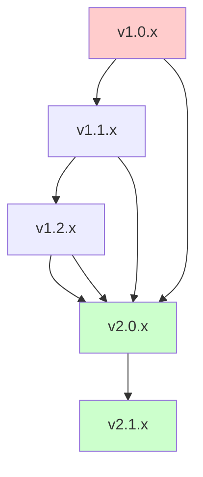

# Migration Guide - Make.com FastMCP Server

## Overview

This guide provides step-by-step instructions for migrating between versions of the Make.com FastMCP Server. It covers breaking changes, deprecations, and provides automated tools and scripts to help with the migration process.

## Table of Contents

1. [Migration Planning](#migration-planning)
2. [Version Migration Paths](#version-migration-paths)
3. [Breaking Changes by Version](#breaking-changes-by-version)
4. [Migration Tools](#migration-tools)
5. [Step-by-Step Migration Procedures](#step-by-step-migration-procedures)
6. [Rollback Procedures](#rollback-procedures)
7. [Testing Your Migration](#testing-your-migration)
8. [Common Migration Issues](#common-migration-issues)
9. [Getting Help](#getting-help)

## Migration Planning

### Pre-Migration Checklist

Before starting any migration:

- [ ] **Backup Current Configuration**: Save all environment files, custom configurations
- [ ] **Document Current Integration**: List all tools and parameters your application uses
- [ ] **Review Version Changelog**: Read release notes for all versions between current and target
- [ ] **Test Environment Setup**: Prepare a testing environment for migration validation
- [ ] **Schedule Maintenance Window**: Plan for potential downtime during migration
- [ ] **Team Communication**: Notify all stakeholders about the planned migration

### Migration Risk Assessment

#### Low Risk Migrations
- **PATCH versions** (1.0.0 → 1.0.1): Bug fixes, security patches
- **MINOR versions within same major** (1.0.0 → 1.1.0): New features, compatible changes

#### Medium Risk Migrations  
- **Major version jumps** (1.x → 2.0): Breaking changes but within documented migration path
- **Multiple minor versions** (1.0.0 → 1.5.0): Multiple feature additions

#### High Risk Migrations
- **Multiple major versions** (1.x → 3.0): Multiple breaking changes
- **EOL version migrations**: Migrating from end-of-life versions
- **Custom integrations**: Heavy use of undocumented or deprecated features

## Version Migration Paths

### Supported Migration Paths



#### Direct Migration Paths
- **v1.x → v2.0**: Supported with migration tools
- **v2.x → v3.0**: Planned for future releases

#### Unsupported Migrations
- **Pre-v1.0 → Any**: Must upgrade to v1.0 first
- **Skip major versions**: v1.x → v3.0 not supported

### Migration Timeline Recommendations

#### For Production Systems
1. **Test in staging**: Minimum 1 week testing period
2. **Gradual rollout**: Deploy to development → staging → production
3. **Monitor period**: 2 weeks of enhanced monitoring post-migration

#### For Development Systems
1. **Direct migration**: Can migrate directly to target version
2. **Immediate validation**: Test key workflows immediately

## Breaking Changes by Version

### v2.0.0 Breaking Changes

#### Authentication System Changes

**What Changed**: Enhanced authentication with multiple provider support

**Migration Required**: Yes - Configuration file changes

**Before (v1.x)**:
```bash
AUTH_ENABLED=true
AUTH_SECRET=simple_secret_key
```

**After (v2.0)**:
```bash
AUTH_ENABLED=true
AUTH_PROVIDERS=apikey,oauth2,jwt
AUTH_APIKEY_SECRET=simple_secret_key  # Renamed from AUTH_SECRET
```

**Migration Steps**:
1. Update environment variables using migration script
2. Test authentication with existing clients
3. Configure additional providers if needed

#### Tool Parameter Changes

**Tool**: `create-scenario`
**Change**: `teamId` parameter type changed from `number` to `string` (UUID format)

**Before (v1.x)**:
```typescript
await client.callTool('create-scenario', {
  name: 'My Scenario',
  teamId: 12345  // number
});
```

**After (v2.0)**:
```typescript
await client.callTool('create-scenario', {
  name: 'My Scenario', 
  teamId: 'uuid-string-here'  // UUID string
});
```

**Migration**: Server automatically converts legacy numeric IDs to UUIDs during transition period (v1.9 - v2.1)

#### Tool Removals

**Removed Tools**:
- `get-scenario-logs` → Replaced by `get-execution-analytics`
- `legacy-connection-test` → Replaced by `test-connection-v2`

**Migration**: Use replacement tools with parameter mapping (see tool-specific guides below)

### v1.5.0 Changes (Non-Breaking)

#### New Tools Added
- `get-execution-analytics`: Enhanced analytics with filtering
- `bulk-update-scenarios`: Batch scenario operations
- `export-scenario-data`: Data export capabilities

#### Deprecated Tools
- `get-scenario-logs`: Still works but shows deprecation warnings

### v1.2.0 Changes (Non-Breaking)

#### Enhanced Parameters
- All tools now support optional `description` parameter
- Response formats include additional metadata fields
- Improved error message details

## Migration Tools

### Automated Migration Scripts

#### Authentication Configuration Migrator

```bash
#!/bin/bash
# scripts/migrate-auth-v2.sh

echo "🔄 Migrating authentication configuration to v2.0..."

# Backup existing configuration
cp .env .env.v1.backup
echo "📋 Backed up existing configuration to .env.v1.backup"

# Create new configuration
cp .env .env.temp

# Migrate AUTH_SECRET to AUTH_APIKEY_SECRET
if grep -q "^AUTH_SECRET=" .env; then
    AUTH_SECRET_VALUE=$(grep "^AUTH_SECRET=" .env | cut -d'=' -f2)
    sed -i.bak "s/^AUTH_SECRET=.*/AUTH_APIKEY_SECRET=$AUTH_SECRET_VALUE/" .env.temp
    echo "AUTH_PROVIDERS=apikey" >> .env.temp
    echo "✅ Migrated AUTH_SECRET to AUTH_APIKEY_SECRET"
fi

# Remove old AUTH_SECRET if it exists
sed -i.bak '/^AUTH_SECRET=/d' .env.temp

# Apply changes
mv .env.temp .env
rm -f .env.bak .env.temp.bak

echo "✅ Migration complete! Review .env and configure additional auth providers if needed."
echo "🔍 Compare changes: diff .env.v1.backup .env"
```

#### Tool Call Migrator

```typescript
// scripts/migrate-tool-calls.ts
import { FastMCPClient } from './lib/client';

interface ToolMigration {
  oldTool: string;
  newTool: string;
  parameterMapping: (oldParams: any) => any;
  responseMapping?: (newResponse: any) => any;
}

const TOOL_MIGRATIONS: ToolMigration[] = [
  {
    oldTool: 'get-scenario-logs',
    newTool: 'get-execution-analytics',
    parameterMapping: (oldParams) => ({
      scenarioId: oldParams.scenarioId,
      filters: {
        dateRange: {
          start: oldParams.startDate,
          end: oldParams.endDate
        }
      },
      pagination: {
        limit: oldParams.limit || 100
      }
    }),
    responseMapping: (newResponse) => ({
      // Transform new format back to legacy format if needed
      logs: newResponse.executions.map(exec => ({
        id: exec.executionId,
        timestamp: exec.startedAt,
        status: exec.status,
        data: exec.summary
      }))
    })
  }
];

export class ToolCallMigrator {
  constructor(private client: FastMCPClient) {}

  async migrateCall(toolName: string, params: any): Promise<any> {
    const migration = TOOL_MIGRATIONS.find(m => m.oldTool === toolName);
    
    if (!migration) {
      // No migration needed, call directly
      return this.client.callTool(toolName, params);
    }

    console.warn(`⚠️  Tool '${toolName}' is deprecated. Using '${migration.newTool}' instead.`);
    
    // Migrate parameters
    const newParams = migration.parameterMapping(params);
    
    // Call new tool
    const response = await this.client.callTool(migration.newTool, newParams);
    
    // Transform response if needed
    if (migration.responseMapping) {
      return migration.responseMapping(response);
    }
    
    return response;
  }
}

// Usage example
const migrator = new ToolCallMigrator(client);

// This will automatically use get-execution-analytics instead
const logs = await migrator.migrateCall('get-scenario-logs', {
  scenarioId: 12345,
  startDate: '2024-01-01',
  limit: 50
});
```

### Configuration Validation Tool

```typescript
// scripts/validate-config.ts
import * as z from 'zod';
import { readFileSync } from 'fs';
import { config } from 'dotenv';

const V2ConfigSchema = z.object({
  // Required fields
  MAKE_API_KEY: z.string().min(1),
  
  // Authentication (if enabled)
  AUTH_ENABLED: z.string().optional(),
  AUTH_PROVIDERS: z.string().optional(),
  AUTH_APIKEY_SECRET: z.string().optional(),
  
  // Optional fields with validation
  MAKE_BASE_URL: z.string().url().optional(),
  PORT: z.string().regex(/^\d+$/).optional(),
  LOG_LEVEL: z.enum(['debug', 'info', 'warn', 'error']).optional(),
});

export function validateV2Config(): { valid: boolean; errors: string[] } {
  config(); // Load .env file
  
  const validation = V2ConfigSchema.safeParse(process.env);
  
  if (validation.success) {
    return { valid: true, errors: [] };
  }
  
  const errors = validation.error.errors.map(err => 
    `${err.path.join('.')}: ${err.message}`
  );
  
  return { valid: false, errors };
}

// CLI usage
if (require.main === module) {
  const result = validateV2Config();
  
  if (result.valid) {
    console.log('✅ Configuration is valid for v2.0');
  } else {
    console.log('❌ Configuration validation failed:');
    result.errors.forEach(error => console.log(`  - ${error}`));
    process.exit(1);
  }
}
```

## Step-by-Step Migration Procedures

### Migrating from v1.x to v2.0

#### Step 1: Preparation

```bash
# 1. Create backup of current setup
mkdir backup-v1
cp .env backup-v1/
cp -r node_modules backup-v1/ 2>/dev/null || true

# 2. Check current version
npm list make-fastmcp-server

# 3. Review breaking changes
curl -s https://api.github.com/repos/your-org/make-fastmcp-server/releases/tags/v2.0.0
```

#### Step 2: Update Dependencies

```bash
# 1. Update package.json
npm install make-fastmcp-server@^2.0.0

# 2. Check for peer dependency conflicts
npm ls --depth=0

# 3. Update related packages if needed
npm audit fix
```

#### Step 3: Configuration Migration

```bash
# 1. Run authentication migration script
chmod +x scripts/migrate-auth-v2.sh
./scripts/migrate-auth-v2.sh

# 2. Validate new configuration
npm run validate-config

# 3. Review changes
diff backup-v1/.env .env
```

#### Step 4: Code Migration

```typescript
// 1. Update tool calls in your application
// Replace deprecated tools with new ones

// Before (v1.x)
const logs = await client.callTool('get-scenario-logs', {
  scenarioId: 12345,
  startDate: '2024-01-01'
});

// After (v2.0)
const analytics = await client.callTool('get-execution-analytics', {
  scenarioId: 12345,
  filters: {
    dateRange: { start: '2024-01-01' }
  }
});

// 2. Update parameter types for breaking changes
// teamId: number → string (UUID)
const scenario = await client.callTool('create-scenario', {
  name: 'My Scenario',
  teamId: await resolveTeamUUID(numericTeamId) // Convert number to UUID
});
```

#### Step 5: Testing

```bash
# 1. Run configuration validation
npm run validate-config

# 2. Test basic connectivity
npm run test:connection

# 3. Run integration tests
npm run test:integration

# 4. Validate tool functionality
npm run test:tools
```

#### Step 6: Deployment

```bash
# Development environment
npm run start:dev

# Staging environment  
npm run deploy:staging

# Production environment (after validation)
npm run deploy:production
```

### Migrating Individual Tools

#### get-scenario-logs → get-execution-analytics

**Migration Complexity**: Medium
**Breaking Changes**: Parameter structure, response format

**Step-by-step**:

1. **Update parameter structure**:
```typescript
// Before
const params = {
  scenarioId: 12345,
  startDate: '2024-01-01',
  endDate: '2024-01-31',
  limit: 100
};

// After
const params = {
  scenarioId: 12345,
  filters: {
    dateRange: {
      start: '2024-01-01',
      end: '2024-01-31'
    }
  },
  pagination: {
    limit: 100
  }
};
```

2. **Handle response format changes**:
```typescript
// Response transformation helper
function transformAnalyticsResponse(newResponse: any) {
  return {
    logs: newResponse.executions.map(execution => ({
      id: execution.executionId,
      timestamp: execution.startedAt,
      status: execution.status,
      duration: execution.duration,
      // Map other fields as needed
    }))
  };
}
```

3. **Update error handling**:
```typescript
try {
  const analytics = await client.callTool('get-execution-analytics', params);
  const logs = transformAnalyticsResponse(analytics);
} catch (error) {
  // Handle new error format
  if (error.code === 'INVALID_DATE_RANGE') {
    // New error code in v2.0
    throw new Error('Invalid date range provided');
  }
  throw error;
}
```

#### legacy-connection-test → test-connection-v2

**Migration Complexity**: Low
**Breaking Changes**: Enhanced response format only

```typescript
// Before (still works but deprecated)
const result = await client.callTool('legacy-connection-test', {
  connectionId: 123
});

// After (recommended)
const result = await client.callTool('test-connection-v2', {
  connectionId: 123,
  testType: 'basic' // New optional parameter
});
```

## Rollback Procedures

### Emergency Rollback

If migration fails and immediate rollback is needed:

```bash
#!/bin/bash
# scripts/emergency-rollback.sh

echo "🚨 Performing emergency rollback to v1.x..."

# 1. Stop current service
npm run stop 2>/dev/null || true

# 2. Restore backup configuration
if [ -f "backup-v1/.env" ]; then
    cp backup-v1/.env .env
    echo "✅ Restored v1.x configuration"
fi

# 3. Downgrade package
npm install make-fastmcp-server@^1.0.0

# 4. Clear any v2.x cache
rm -rf node_modules/.cache 2>/dev/null || true

# 5. Restart service
npm run start

echo "✅ Rollback complete. Service running on v1.x"
```

### Planned Rollback

For testing scenarios where rollback is planned:

```bash
# 1. Document current v2.x state
npm run export-config > config-v2-backup.json

# 2. Graceful service shutdown
npm run stop

# 3. Restore v1.x version
npm install make-fastmcp-server@^1.0.0

# 4. Restore v1.x configuration
cp backup-v1/.env .env

# 5. Validate rollback
npm run validate-config
npm run test:connection

# 6. Restart service
npm run start
```

## Testing Your Migration

### Pre-Migration Testing

```bash
# 1. Test current functionality
npm run test:current-version

# 2. Document current behavior
npm run generate-test-baselines

# 3. Export current configuration
npm run export-config > pre-migration-config.json
```

### Post-Migration Testing

```bash
# 1. Basic connectivity
curl -X POST http://localhost:3000/tools/call \
  -H "Content-Type: application/json" \
  -d '{"name": "server-info", "arguments": {}}'

# 2. Tool functionality tests
npm run test:tools

# 3. Integration tests
npm run test:integration

# 4. Performance comparison
npm run benchmark:migration
```

### Test Scenarios

#### Critical Path Testing

```typescript
// test/migration-validation.test.ts
describe('Migration Validation', () => {
  test('All v1.x tools still work', async () => {
    const tools = ['create-scenario', 'get-connections', 'list-teams'];
    
    for (const toolName of tools) {
      const result = await client.callTool(toolName, sampleParams[toolName]);
      expect(result).toBeDefined();
      expect(result.error).toBeUndefined();
    }
  });

  test('New v2.x tools are available', async () => {
    const newTools = ['get-execution-analytics', 'bulk-update-scenarios'];
    
    for (const toolName of newTools) {
      const tools = await client.callTool('list-tools');
      expect(tools.find(t => t.name === toolName)).toBeDefined();
    }
  });

  test('Deprecated tools show warnings', async () => {
    const result = await client.callTool('get-scenario-logs', {
      scenarioId: 123
    });
    
    expect(result.warnings).toBeDefined();
    expect(result.warnings[0].type).toBe('deprecation');
  });
});
```

## Common Migration Issues

### Issue 1: Authentication Failures After Migration

**Symptoms**: 401 Unauthorized errors after migrating to v2.0

**Cause**: AUTH_SECRET renamed to AUTH_APIKEY_SECRET

**Solution**:
```bash
# Check current auth configuration
grep AUTH_ .env

# Fix missing AUTH_APIKEY_SECRET
echo "AUTH_APIKEY_SECRET=your_secret_here" >> .env
echo "AUTH_PROVIDERS=apikey" >> .env
```

### Issue 2: Tool Call Failures with "Tool Not Found"

**Symptoms**: Errors calling tools that worked in v1.x

**Cause**: Tool was renamed or removed in v2.0

**Solution**:
```typescript
// Check available tools
const tools = await client.callTool('list-tools');
console.log('Available tools:', tools.map(t => t.name));

// Use replacement tool
// get-scenario-logs → get-execution-analytics
// legacy-connection-test → test-connection-v2
```

### Issue 3: Parameter Validation Errors

**Symptoms**: "Invalid parameter type" errors

**Cause**: Parameter types changed (e.g., teamId: number → string)

**Solution**:
```typescript
// Convert numeric IDs to UUIDs
const teamUUID = await client.callTool('resolve-team-uuid', {
  numericId: 12345
});

// Use UUID in subsequent calls
await client.callTool('create-scenario', {
  name: 'My Scenario',
  teamId: teamUUID // String UUID instead of number
});
```

### Issue 4: Performance Degradation

**Symptoms**: Slower response times after migration

**Cause**: New features may require additional processing

**Solution**:
```bash
# Check resource usage
npm run monitor:performance

# Optimize configuration
echo "CACHE_ENABLED=true" >> .env
echo "CACHE_TTL=300" >> .env

# Restart service
npm run restart
```

### Issue 5: Configuration Validation Failures

**Symptoms**: Server won't start, configuration errors

**Cause**: Invalid or missing required configuration in v2.0

**Solution**:
```bash
# Run configuration validator
npm run validate-config

# Fix reported issues
# Add missing required fields
# Correct invalid values
# Remove deprecated settings
```

## Getting Help

### Documentation Resources

- **API Reference**: `/docs/api-reference.md`
- **Configuration Guide**: `/docs/configuration.md`
- **Troubleshooting**: `/docs/troubleshooting.md`
- **Version History**: `/CHANGELOG.md`

### Community Support

- **GitHub Issues**: Report bugs and request features
- **Discord Community**: Real-time chat support
- **Stack Overflow**: Tag questions with `make-fastmcp-server`

### Professional Support

- **Priority Support**: Available for enterprise customers
- **Migration Services**: Professional migration assistance
- **Custom Integration**: Tailored integration development

### Logging and Diagnostics

Enable detailed logging during migration:

```bash
# Enable debug logging
export LOG_LEVEL=debug

# Enable migration tracing
export TRACE_MIGRATIONS=true

# Start server with enhanced logging
npm run start:debug
```

### Migration Support Tools

```bash
# Generate migration report
npm run migration:report

# Validate migration completeness
npm run migration:validate

# Performance comparison
npm run migration:benchmark
```

---

This migration guide provides comprehensive coverage for all common migration scenarios. For specific issues not covered here, consult the detailed API documentation or contact support.